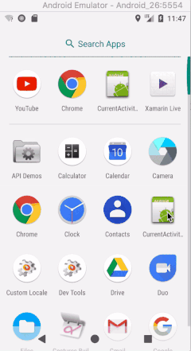

This plugin is no longer needed as it is directly built into Xamarin.Essentials and .NET MAUI with Platform Extensions. See the [documentation](https://learn.microsoft.com/xamarin/essentials/platform-extensions)


# Current Activity Plugin for Xamarin.Android

This plugin gives developers and library creators easy access to an Android Application’s current Activity that is being displayed.

Want to read about the creation, check out my [in-depth blog post](http://motzcod.es/post/133609925342/access-the-current-android-activity-from-anywhere).

## Setup

* Available on NuGet: http://www.nuget.org/packages/Plugin.CurrentActivity [](https://www.nuget.org/packages/Plugin.CurrentActivity/)
* Install into your Xamarin.Android Client project.

Build Status: 

CurrentActivity Readme

This plugin provides base functionality for Plugins for Xamarin to gain access to the application's main Activity.

## Getting Started

## Version 1.0

Please read the following guide: https://github.com/jamesmontemagno/CurrentActivityPlugin/blob/6458fd91e83c6b56bbfda2c80b5cefcdbae2fe0a/nuget/readme.txt

## Version 2.0 

When the plugin is installed, follow the below steps to initialize in your project. There are two ways to initialize this:

### Main/Base Activity Level

1. Simply call the `Init` method on OnCreate

```csharp
CrossCurrentActivity.Current.Init(this, bundle);
```

### Application Level

1. Add a new C# class file in your project called "MainApplication.cs".
2. Override the `OnCreate` method and call the `Init` method

```csharp
#if DEBUG
[Application(Debuggable = true)]
#else
[Application(Debuggable = false)]
#endif
public class MainApplication : Application
{
	public MainApplication(IntPtr handle, JniHandleOwnership transer)
		: base(handle, transer)
	{
	}

	public override void OnCreate()
	{
		base.OnCreate();
		CrossCurrentActivity.Current.Init(this);
	}
}
```
If you already have an "Application" class in your project simply add the Init call. 

The benefit of adding it at the Application level is to get the first events for the application.

## API Usage

Call **CrossCurrentActivity.Current** from your Android project to gain access to APIs.

```csharp
/// <summary>
/// Gets or sets the activity.
/// </summary>
/// <value>The activity.</value>
Activity Activity { get; set; }

/// <summary>
/// Gets the current Application Context.
/// </summary>
/// <value>The activity.</value>
Context AppContext { get; }

/// <summary>
/// Fires when activity state events are fired
/// </summary>
event EventHandler<ActivityEventArgs> ActivityStateChanged;
```

So you can totally do something like this:

```csharp
void Register()
{
    CrossCurrentActivity.Current.ActivityStateChanged += Current_ActivityStateChanged;
}

private void Current_ActivityStateChanged(object sender, ActivityEventArgs e)
{
    Toast.MakeText(Application.Context, $"Activity Changed: {e.Activity.LocalClassName} -  {e.Event}", ToastLength.Short).Show();
}
```



That’s it!

**Library Creators**

Simply set this nuget as a dependency of your project to gain access to the current activity.
